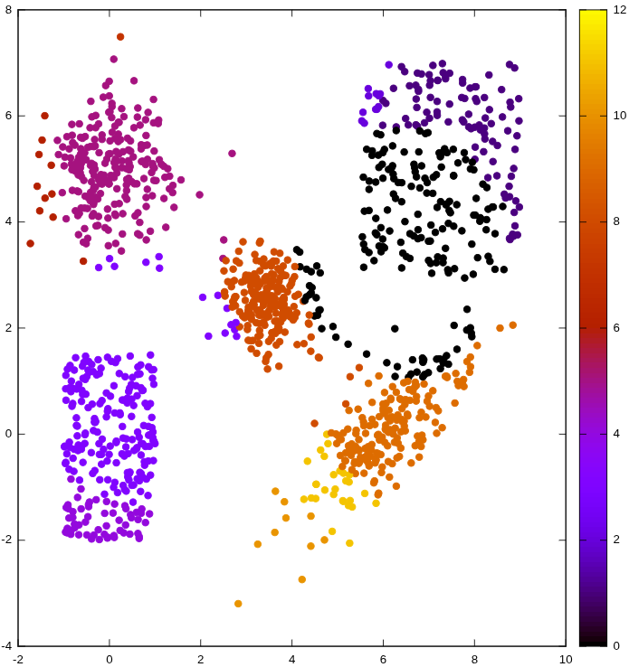
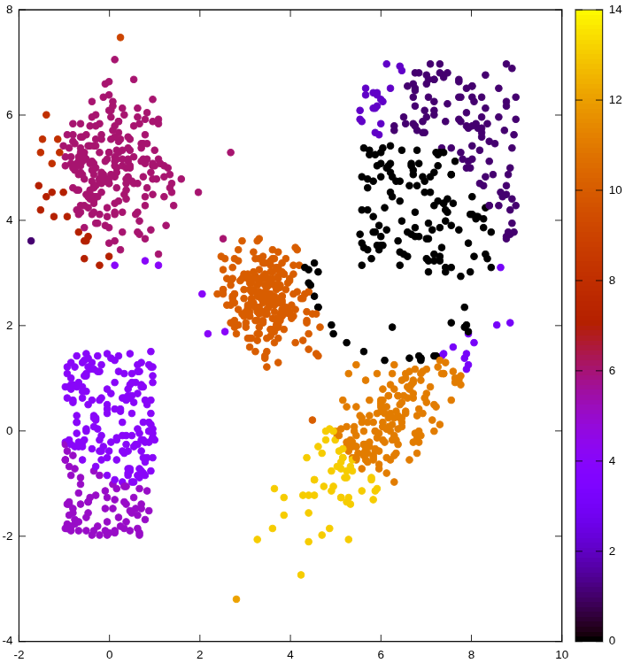

# Entropy-Based 2D Clustering Engine — SystemVerilog / ASIC

A 2D point-clustering algorithm — normally run in floating point on a CPU — reimplemented as a streaming hardware pipeline in SystemVerilog, taken through a full ASIC flow (RTL → GDSII) on a real memory-macro library. No soft-core CPU, no HLS: every arithmetic step, memory access, and control decision is hand-designed RTL.


---

## What this is

The clustering algorithm groups 2D points into clusters using an iterative, entropy-based method — it never needs to know the number of clusters or their centers in advance, unlike k-means. It was designed in software (C, floating point) by a mathematician colleague at the lab; this project is the full hardware port of that algorithm, from architecture analysis to a working ASIC layout.

**The central problem this architecture solves:** the reference software builds and stores a full `N × N` similarity matrix at every iteration. For 1000 points, that's 1,000,000 coefficients — about 2 MB, rebuilt every single iteration — which is simply not viable in hardware. Every major architectural choice in this project (row-by-row streaming, ping-pong double buffering, on-the-fly normalization) exists to avoid ever materializing that matrix. See [`docs/ARCHITECTURE.md`](docs/ARCHITECTURE.md) §2 for the full reasoning.

## Architecture at a glance

The hardware mirrors the software algorithm's two-phase structure: an iterative loop that moves points toward their neighbours based on entropy, followed by a final pass that assigns cluster numbers.

<table>
<tr>
<td width="50%" align="center"><br><sub>Iterative loop — repeated N times</sub></td>
<td width="50%" align="center"><br><sub>Final cluster assignment</sub></td>
</tr>
</table>

Full toplevel writeup, with the software-to-hardware translation reasoning: [`docs/ARCHITECTURE.md`](docs/ARCHITECTURE.md).

### Key design decisions

| Decision | Summary |
|---|---|
| [ADR-0001](docs/decisions/0001-fixed-point-quantization-chain.md) | Stage-by-stage fixed-point quantization, with a bit-exact software reference model used directly in the testbenches |
| [ADR-0002](docs/decisions/0002-single-row-streaming-vs-full-matrix.md) | Row-by-row streaming instead of storing the full `P` matrix — `O(N²)` → `O(N)` memory |
| [ADR-0003](docs/decisions/0003-ping-pong-buffering.md) | Ping-pong double buffering + duplicated coordinate memories, to overlap `exp` and `grad` |
| [ADR-0004](docs/decisions/0004-lut-exponential-vs-cordic.md) | LUT-based `exp()` and inverse instead of CORDIC |
| [ADR-0005](docs/decisions/0005-gini-entropy-vs-shannon.md) | Gini entropy instead of Shannon — no second nonlinear LUT needed |
| [ADR-0006](docs/decisions/0006-valid-bit-for-unassigned-cluster.md) | Dedicated valid bit instead of a `-1` sentinel for unassigned clusters |
| [ADR-0007](docs/decisions/0007-memory-macro-wrappers.md) | Interface-preserving wrappers around real ASIC memory macros |

### Compute blocks

Each block has its own detailed writeup: [`exp`](docs/blocks/exp_block.md), [`grad`](docs/blocks/grad_block.md), [`ping_pong_arbiter`](docs/blocks/ping_pong_arbiter.md), [`upd`](docs/blocks/upd_block.md), [`cluster_assign`](docs/blocks/cluster_assign.md) — and the three ASIC memory-macro wrappers: [coordinate memory](docs/blocks/coord_mem_wrapper.md), [`P_ij` memory](docs/blocks/pij_mem_wrapper.md), [cluster memory](docs/blocks/cluster_mem_wrapper.md).

## Verification

Every RTL result is compared directly against a **bit-exact fixed-point software reference model** — not a floating-point resimulation — so any mismatch is unambiguously an RTL bug, not a quantization-comparison artifact. The system is verified twice over: once against the behavioral custom memories (`make sim_rtl`), and once against the ASIC macro-backed wrapper memories (`make sim_rtl_bb`) to validate the wrappers before trusting them through synthesis and place-and-route. Full details: [`docs/ARCHITECTURE.md`](docs/ARCHITECTURE.md) §9.

## ASIC flow

Taken through a full RTL → GDSII flow in Cadence Innovus, using two real memory macros (`RAM_4096X32`, `RAM2P_1024X32`) as black boxes. Highlights:

- Manual floorplanning of the memory macros (edges of the die, halos, pin placement) and an iterative area/density optimization pass — routing density improved from ~7% to **74.3%**, core area reduced by **~27%**, with clean DRC and setup timing closed at 100 MHz throughout.
- Memories dominate the design: **~97.6% of total cell area** and **~76% of total power** — see [`docs/asic/RESULTS.md`](docs/asic/RESULTS.md) for the full area/timing/power comparison, and [`docs/asic/FLOW.md`](docs/asic/FLOW.md) for the methodology, including before/after floorplan views.

## Reproducing the clustering pipeline

To run the full software-to-hardware comparison on your own 2D point benchmark:

1. **Add your benchmark.** Create a plain-text file with no header, one point per line: `x`, `y`, and a cluster-number column (the latter unused by the pipeline itself, kept for reference), and place it under `frontend/data/`.
2. **Point the reference model at it.** In `clusterization.c`, edit the benchmark path near the top of the file:
   ```c
   #define BENCHMARK_FILE "../data/cluster.txt"
   ```
   Running `clusterization.c` produces the software clustering result using the full fixed-point quantized chain (see [`docs/ARCHITECTURE.md`](docs/ARCHITECTURE.md) §8) — this is the bit-exact reference the RTL testbench will be checked against.
3. **Run the hardware simulation.** From the directory containing the Makefile:
   ```
   make sim_rtl_bb
   ```
   This runs the full clustering pipeline in RTL, using the ASIC macro-backed wrapper memories (see §9 of `ARCHITECTURE.md`).
4. **Visualize both results.** `frontend/scripts/plot_fixed_c.sh` and `plot_fixed.sh` plot the fixed-point software result and the RTL simulation result respectively. Output lands in `frontend/results_clustering/`.

<table>
<tr>
<td width="50%" align="center"><br><sub>Software reference — fixed-point quantized chain</sub></td>
<td width="50%" align="center"><br><sub>RTL simulation — same benchmark</sub></td>
</tr>
</table>


## Repository structure

```
.
├── README.md
├── Makefile                    # Top-level flow entry point
├── docs/
│   ├── ARCHITECTURE.md         # Toplevel architecture and design rationale
│   ├── blocks/                 # one write-up per RTL block and per memory wrapper
│   ├── decisions/              # ADR-0001 … ADR-0007
│   ├── img/                    # architecture diagrams and result plots
│   └── asic/
│       ├── FLOW.md             # Innovus floorplanning / P&R methodology
│       └── RESULTS.md          # area / timing / power results
├── frontend/
│   ├── data                    # 
│   ├── results_clustering/     # generated plots
│   ├── rtl                     # 
│   ├── scripts/                # plotting scripts (plot_fixed_c.sh, plot_fixed.sh, ...)
│   ├── src_c                   # 
│   ├── synth_files/            # synthesizable RTL (macro wrappers, case-statement LUTs)
│   ├── tb                      # 
│   ├── filelist.f/             # 
│   └── filelist_bb.f/          # 
└── backend/
    └── layout/                 # Innovus deliverables and reports (synthesis, P&R, STA, power)
```

## Status

RTL for all compute blocks and memory wrappers is written, commented, and individually documented. Verified in simulation against a bit-exact software reference, both with behavioral memories and with ASIC macro-backed wrappers. Taken through a full synthesis and place-and-route flow with clean DRC and closed setup timing at 100 MHz; a small hold violation remains at the worst-case corner (see `docs/asic/RESULTS.md` for the full discussion).

## Acknowledgments

The clustering algorithm implemented here in hardware was designed by **Elias De Almeida Ramos**, a mathematician colleague at GMicro (Grupo de Microeletrônica, Universidade Federal de Santa Maria, Brazil), who provided the original C reference implementation this project is based on. A paper describing the algorithm is in preparation for IEEE, with a planned submission to ISCAS 2027 (Bordeaux, France).
