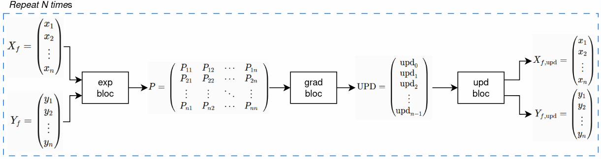
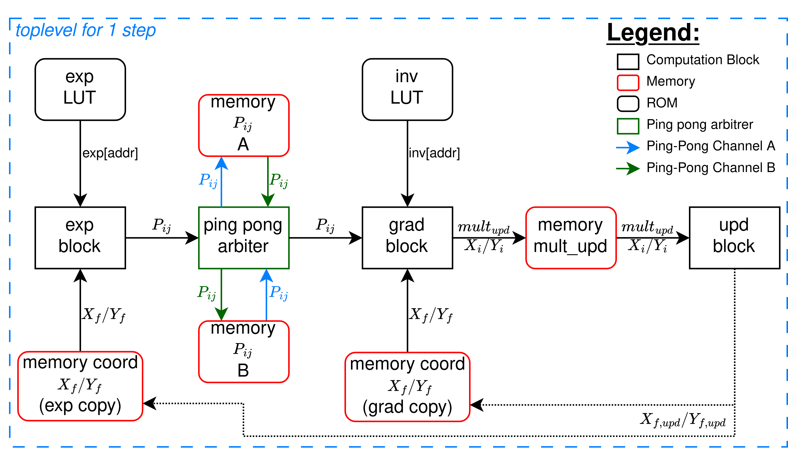
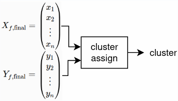
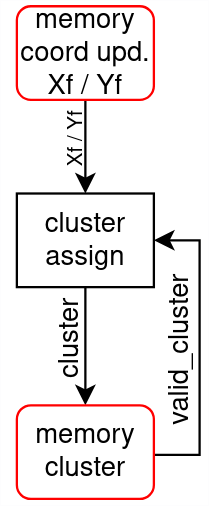

# Architecture — Entropy-Based 2D Clustering Engine

This document walks through the full path of the project: from the software reference model provided by the lab to the SystemVerilog hardware architecture derived from it, covering the quantization work and the design trade-offs along the way. For a quick overview, see the [README](../README.md). For the detailed, argued rationale behind each major decision, see the [ADRs](decisions/).

> **Scope of this document**: the toplevel architecture and the design decisions that structure the project. The internal micro-architecture of the compute blocks — [exp](blocks/exp_block.md), [grad](blocks/grad_block.md), [ping_pong_arbiter](blocks/ping_pong_arbiter.md), [upd](blocks/upd_block.md), [cluster_assign](blocks/cluster_assign.md) — is covered in [blocks/](blocks/).

---

## 1. The software reference model

The starting point is a 2D clustering algorithm developed by a colleague at the lab (Elias De Almeida Ramos), written in C, in double-precision floating point. Its defining feature — and the reason it was picked as a candidate for hardware porting — is that it **does not need to know the center of the point cloud in advance** to work: grouping happens through an iterative mechanism based on computing each point's entropy relative to its neighbours, rather than through a distance to a centroid fixed a priori (unlike k-means, for instance).

At each iteration (`step`), the algorithm:
1. Computes a similarity matrix `P` between all points, via a Gaussian kernel applied to the Euclidean distance between each pair of points.
2. Normalizes each row of `P` (sum = 1).
3. Computes the entropy of each row, used to modulate how strongly the corresponding point moves.
4. Computes a gradient (a weighted displacement toward similar neighbours) and updates each point's position.
5. Repeats over `N` iterations, until the points converge into distinct clusters.
6. A final pass assigns a cluster number to each grouped point.

It's this two-phase structure — **the iterative loop that moves the points**, then **the final cluster assignment** — that directly drove the hardware architecture's split into two parts (see §3).

---

## 2. The observation that shaped the whole architecture: the O(n²) matrix

Looking at the reference code, the first problem jumps out immediately: at every iteration, the algorithm builds and fully stores an `N × N` matrix `P`, where `N` is the number of points in the benchmark.

For a reasonable test set of 1000 points, that's **1,000,000 coefficients**. Even encoded on 16 bits (Q0.16 format after quantization), that's **2 MB of memory, rebuilt every single iteration, for just one of the N iterations of the algorithm**. On a modest FPGA target, or even more so with an ASIC flow in mind where every bit of memory has a direct area cost, this approach is simply not viable as-is.

This observation set the architecture's top priority before a single compute block was even sketched out: **never store the full `P` matrix**. Every other design choice (row-by-row streaming, ping-pong buffering, on-the-fly normalization sum) follows directly from this constraint.

See [ADR-0002](decisions/0002-single-row-streaming-vs-full-matrix.md) for the full discussion of this choice and the alternative that was ruled out.

---

## 3. Overview: two functional parts

The hardware architecture mirrors the software model's structure with two higher-level blocks, each corresponding to one phase of the original algorithm.

### Part 1 — Iterative loop (repeated `N` times)

*Software reference model for one iteration: building `P`, computing the gradient, updating coordinates.*

This step is translated into hardware by the following pipeline, executed once per iteration:

The data flow follows the same logic as the software model (`exp` → matrix `P` → `grad` → coordinate update), but **without ever materializing `P` in full**: that's the entire purpose of the `ping pong arbiter` block at the center of the diagram, detailed in §4.

### Part 2 — Final cluster assignment

Once the `N` iterations are complete, the points' final coordinates have converged into clusters. The `cluster assign` block then assigns a cluster number to each point based on its final position:

One toplevel design point is worth noting here: the `memory cluster` associates a cluster number with each point, but a point may not yet have been assigned one. Where the software reference model uses a sentinel value (`-1`) to represent that state, the hardware architecture carries this information through a **dedicated valid bit** (`valid_cluster`, visible on the diagram above) rather than a reserved value in the cluster-number field. See [ADR-0006](decisions/0006-valid-bit-for-unassigned-cluster.md).

---

## 4. Memory architecture of the iterative loop

This is the technical core of the project. Three problems chain into each other, each solved by a specific architectural choice.

### 4.1 Storing only one row of `P` at a time

Rather than building `P` in full, the `exp` block produces `P` **row by row**: for a given point `i`, it computes the `N` coefficients `P[i][0..N-1]` and writes them into a buffer memory that can only hold a single row. The `grad` block then reads that row to compute point `i`'s contribution to the gradient. Once that row has been consumed, `exp` can write the next one.

This drops the memory footprint from `O(N²)` to `O(N)` — for 1000 points, that's a drop from 2 MB to a few KB.

### 4.2 Ping-pong between two row buffers

The straightforward sequential chaining described above (exp writes → grad reads → exp writes again) introduces significant dead time: `grad` has to wait for `exp` to finish writing, and `exp` has to wait for `grad` to finish reading before it can reuse the buffer.

To overlap these two phases, the architecture uses **two row buffers (A and B)** driven by a `ping pong arbiter` block: while `exp` writes row `i+1` into buffer A, `grad` simultaneously reads row `i` (already produced) from buffer B. Once both are done, the arbiter swaps the two buffers' roles, with no data copy — only the routing table changes.

See [ADR-0003](decisions/0003-ping-pong-buffering.md).

### 4.3 Duplicating the coordinate memories

This overlap introduces a secondary constraint of its own: the `exp` and `grad` blocks need to read point coordinates **simultaneously** (each for the row it's currently processing). A single coordinate memory with one read port would put them in access conflict.

The solution adopted is to **duplicate** the coordinate memory (one copy for `exp`, one for `grad`). On the face of it, this works against the initial goal of memory frugality — but the cost is marginal: coordinates are encoded on 16 bits in Q8.8, so even duplicated, this memory remains far smaller than the full `P` matrix would have been. In exchange, the two compute blocks can work in parallel, halving compute time. This trade-off is detailed in the same ADR-0003.

### 4.4 "Dual-port"-style organization of the coordinate memories

Each coordinate memory is organized so that a single address (the point index) returns **both the `x` and `y` components** of that point at once, rather than requiring two separate accesses. A point's two values thus always stay accessed together, which simplifies the interface with `exp` and `grad`.

### 4.5 Update memory (`memory update`)

As `grad` computes the update contribution for each point, the results are accumulated into a `memory update`, comparable in size to the coordinate memories (two Q8.8 values per point: the `x` and `y` updates). Once every point in the iteration has been processed, this memory is full, and the `upd` block can apply the update to both coordinate memories to close out the current iteration.

### 4.6 `P` row format

Each row memory (A or B) holds `N` coefficients encoded on 16 bits in **Q0.16** format (normalized similarity values between 0 and 1).

---

## 5. Nonlinear functions: `exp()` and the inverse, without CORDIC

Computing the Gaussian kernel (matrix `P`) requires an exponential, and normalizing each row requires a division (implemented as a multiplication by the inverse of the sum).

The classic hardware implementation of these two functions would be CORDIC — but the combinational or pipelined architecture it requires is heavy to integrate for a gain that isn't justified here. A study of the actual range of arguments taken by `exp()` on the software reference model showed that this range is in fact **narrow and bounded** (the argument, always negative, saturates quickly toward 0 below a certain threshold). This made it possible to replace CORDIC with two **LUTs**:

- **`exp` LUT**: addressed directly by the quantized argument (Q6.10 format), 10241 entries encoded in Q0.16.
- **Inverse LUT (`inv`)**: used for normalization. Unlike the `exp` LUT, it is addressed by the **mantissa** of the row sum (MSB extraction + shift), which covers a wide dynamic range of sum values with only 1024 entries.

See [ADR-0004](decisions/0004-lut-exponential-vs-cordic.md).

---

## 6. Streaming normalization, with no hidden buffer

Normalizing a row of `P` requires the sum of all its coefficients. Rather than recomputing that sum in a separate pass, it is accumulated **directly by the `exp` block**, as it produces and writes the unnormalized coefficients into buffer A or B. The `grad` block, when it later reads that row, applies the normalization via the inverse LUT described in §5.

This choice upholds the guiding principle of the whole architecture: **no hidden memory inside the compute blocks, no intermediate data stored outside the identified row buffers** — everything happens in a flow, within a pipeline.

---

## 7. Entropy: Gini rather than Shannon

Computing the entropy of each row of `P` (used to modulate how strongly each point moves) runs into, in the software reference model, the same problem as the exponential: Shannon entropy requires a `log()`.

Rather than adding a second nonlinear LUT for `log()`, the hardware architecture uses **Gini entropy** as a substitute: a dispersion measure that is algebraically equivalent for the purpose needed here, but which is computed purely from a sum of squares of the row's coefficients — directly from the multipliers already present in the pipeline, with no additional nonlinear function.

See [ADR-0005](decisions/0005-gini-entropy-vs-shannon.md) for the quantified comparison between the two measures and the deviation accepted relative to the reference model.

---

## 8. Quantization chain and bit-exact reference model

The entire compute chain (distance, exponential argument, `P` coefficients, gradient, position update) was quantized **stage by stage**, measuring the error introduced at each stage against the equivalent floating-point computation, rather than through a single approximate global conversion. This made it possible to size each Q format as tightly as possible (neither over-sized in area, nor under-sized to the point of degrading the algorithm's convergence).

| Quantity | Format | Note |
|---|---|---|
| Point coordinates (`X_f`, `Y_f`) | Q8.8, 16 bits | Sufficient after the initial normalization of points into the [0, 255] range |
| Exponential argument | Q6.10 | Narrow range justifying the LUT (§5) |
| `P` coefficients (unnormalized then normalized) | Q0.16 | Direct output of the `exp` LUT, reused as-is after normalization |
| Row sum / inverse LUT addressing | Dynamically extracted mantissa | Covers a wide dynamic range with a fixed-size LUT |
| Gini entropy (`H_fixed`) | Q0.16 | One's complement of the sum of normalized squares |

This stage-by-stage quantization has a second benefit, independent of bus sizing: once applied throughout, it makes it possible to run the **software reference model entirely in fixed-point**, alongside its original floating-point version. This "bit-exact" model produces every intermediate result expected from the hardware (matrix `P`, gradients, entropies, updates), and serves as a direct reference for the testbenches: RTL simulation results are compared directly against this model rather than against an approximate floating-point resimulation.

See [ADR-0001](decisions/0001-fixed-point-quantization-chain.md).

---

## 9. Top-level sequencing and coordinate-memory ownership

Everything described so far explains how each mechanism works on its own. This section covers the two things that only exist at the toplevel, tying the whole pipeline together across the `NB_ITER` iterations: how iterations chain into each other automatically, and how the two duplicated coordinate memories end up shared, over time, by more than just `exp` and `grad`.

### 9.1 Iteration chaining

Only the very first iteration needs an external `start` pulse. From there, the toplevel advances the pipeline on its own:

1. A per-row counter tracks how many rows `grad` has finished (`done` pulses, one per row) within the current iteration. Once all `NB_POINTS` rows are done, the iteration's compute phase is complete, and `act_coord`'s update pass is launched.
2. Once `act_coord` finishes updating every point's coordinates, the toplevel checks whether more iterations remain. If so, it advances the iteration counter and relaunches `exp`/`grad` for the next iteration — no external intervention needed.
3. Once the last iteration's update pass completes, a one-shot latch fires exactly once to launch the final `cluster_assign` pass instead of relaunching `exp`/`grad` again.

This chain — row-sweep complete → update → next iteration (or final clustering) → repeat — is what turns `NB_ITER` separate row-sweeps into a single self-driving pipeline from the outside.

### 9.2 Coordinate-memory ownership handoff

`exp` and `grad` each read from their own dedicated copy of the coordinate memory (§4.3, ADR-0003) throughout normal computation. But two other moments need access to those same memories:

- **`act_coord`'s update pass** (§4.5) needs to *write* the newly computed coordinates into **both** copies at once, to keep them in sync for the next iteration.
- **`cluster_assign`'s final pass** (§3, Part 2) needs to *read* the converged coordinates once every iteration is done — from the `exp`-side copy only, since there's no further need for two independent read ports once the iterative loop has ended.

Rather than have `exp`, `grad`, `act_coord`, and `cluster_assign` coordinate access to these memories directly with each other, the toplevel introduces a single point of arbitration per memory: each coordinate memory's port is time-shared between up to four possible requesters — an external load path (used to initialize the point set before the pipeline starts, and to read results back out), the owning block's own normal compute reads, `act_coord`'s broadcast write, and, for the `exp`-side copy only, `cluster_assign`'s final read pass. A priority mux selects exactly one requester per cycle: an external load always takes priority when active, `act_coord`'s update window overrides normal compute access once an iteration's compute is fully done, and `cluster_assign` takes over exclusively once every iteration has completed.

The benefit of concentrating this in one place is that none of the four compute blocks needs to know the others exist: `exp` always just reads "its" coordinate memory, `act_coord` always just writes an update, and so on — the toplevel is the only place that needs to reason about who is allowed to touch a given memory at a given moment. See the toplevel RTL (`clusterization.sv`) for the exact ownership priority logic.

---

## 10. Verification strategy

Design verification follows two levels, both compared against the bit-exact reference model described in §8 rather than against a floating-point resimulation:

- **Unit testbenches**, one per compute block (`exp`, `grad`, `upd`, `cluster_assign`), used to isolate and validate each block's behavior independently of the rest of the chain — particularly useful for debugging a block without depending on the availability or correctness of the others.
- **Global or partially-global integration testbenches**, exercising subsets of, or the entire, toplevel pipeline on a full point set, and comparing end-to-end results — final coordinates and assigned clusters — against those produced by the reference model.

In both cases, the comparison is made directly against the intermediate results produced by the fixed-point software model (§8): the `P` matrix row by row, gradients, entropies, position updates. Any discrepancy between RTL simulation and the reference model is therefore unambiguously attributable to the RTL, not to a comparison artifact between floating-point and fixed-point.

On top of this, the full system was verified **twice over**, on two different memory implementations:

- With the **behavioral custom memories** (`memory_dual_port`, `memory_single_port`, `memory_cluster`) — the everyday simulation target, run via the `sim_rtl` Makefile target.
- With the **macro-backed wrapper memories** (see [ADR-0007](decisions/0007-memory-macro-wrappers.md) and the `docs/blocks/*_mem_wrapper.md` files) — i.e. the same testbenches, but exercising the wrapper RTL that instantiates behavioral models of the ASIC black-box macros, run via a dedicated `sim_rtl_bb` Makefile target ("bb" for black box). This target loads a different filelist, pointing at the wrapper memories located under `frontend/synth_files` (the same source tree used for synthesis) instead of the plain behavioral memories.

Every other testbench in the project runs under `sim_rtl` against the custom memories; only the full-system testbench needs to also be run under `sim_rtl_bb` to confirm the wrappers behave correctly end-to-end before trusting them through the ASIC flow. When switching between the two, the only thing that needs to change in the Makefile is the module name exported via `DESIGNS` — the testbench itself, and the comparison against the bit-exact reference model, stay exactly the same either way.
