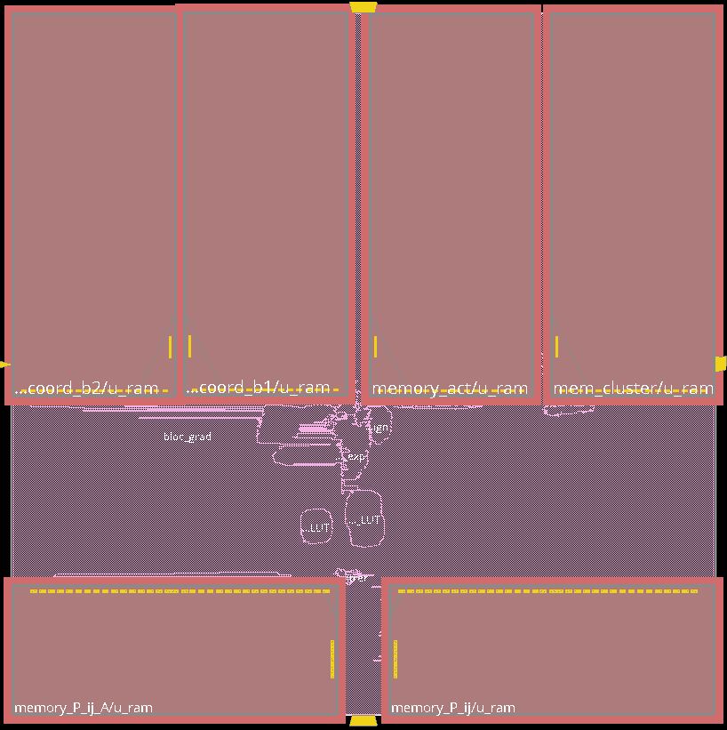
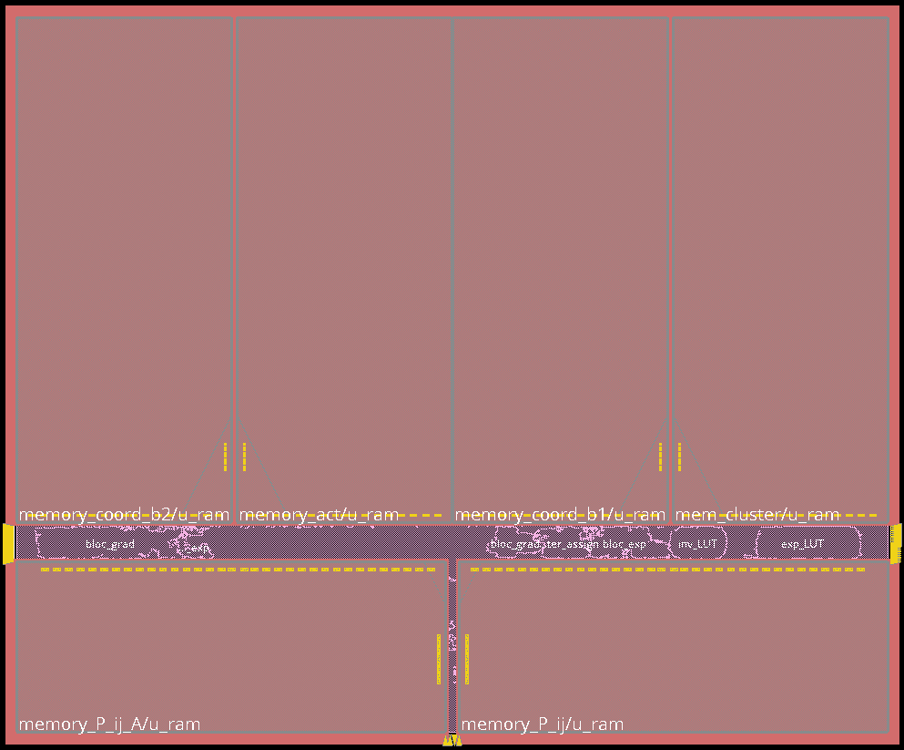
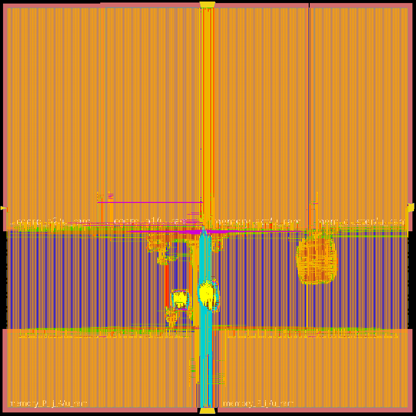
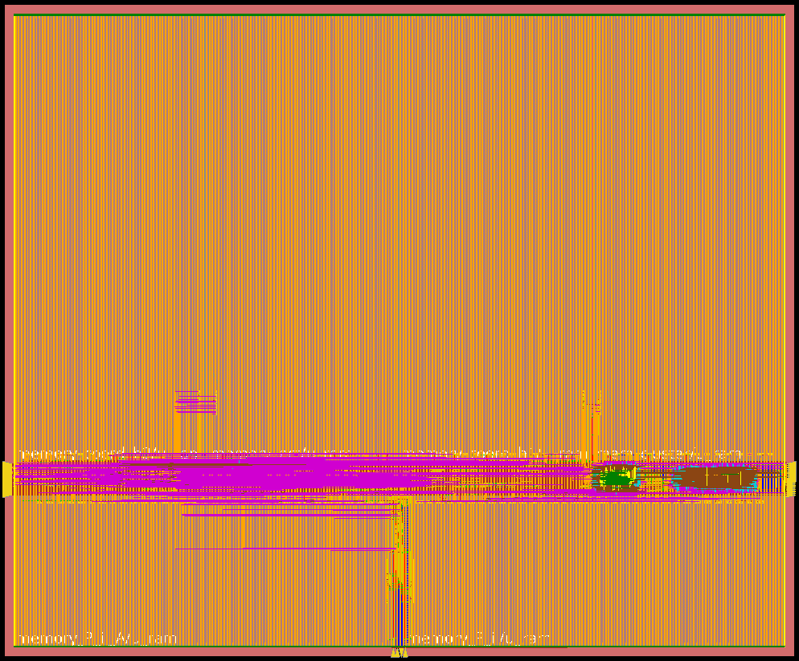

# ASIC Flow — Methodology

Documents the RTL → GDSII flow followed for this design, using Cadence Genus for synthesis and Cadence Innovus for place-and-route, focusing on what changed compared to a "plain" digital flow once real memory macros entered the design (see [ADR-0007](../decisions/0007-memory-macro-wrappers.md) for why macros were introduced, and the `docs/blocks/*_mem_wrapper.md` files for the RTL-side wrapper changes this required).

For final numbers (area, timing, power), see [`RESULTS.md`](RESULTS.md).

---

## 1. Overview

The flow follows the standard stages — synthesis, floorplanning, placement, clock tree synthesis, routing, signoff — with two stages requiring specific attention because of the memory macros: **floorplanning** (macros are physically large, fixed-shape black boxes that need to be placed deliberately, not left to automatic standard-cell placement) and **area/density tuning** (covered in §3).

## 2. Macro floorplanning

### 2.1 Interactive placement via `gui_show` / `suspend` / `resume`

The layout `.tcl` script calls `gui_show` followed by `suspend`, which opens the Innovus GUI and pauses the script at that point. This is the point where the memory macros are placed manually and interactively rather than left to automatic placement: each macro is dragged into position and oriented so its ports face the right direction for routing. Once satisfied with the placement, `resume` is issued from the terminal to let the script continue and complete place-and-route automatically from there.

### 2.2 Placement strategy

Macros are placed along the **edges** of the chip, leaving the **center** of the floorplan free for standard-cell logic. This keeps the large, fixed-footprint macros out of the way of the logic that needs flexible placement and routing, and keeps the macro-to-macro and macro-to-logic routing paths short and predictable.

### 2.3 Pin placement

Once the macros were placed, it became clear that Innovus's default I/O pin placement put several pins behind or inside the macro footprints — not routable without going around the macros. Pin locations were adjusted manually so that the design's I/O pins land in the gaps *between* macros, where the router can actually reach them.

## 3. Halos around macros

Macros are surrounded by placement halos — keep-out margins where Innovus is not allowed to place standard cells — sized differently depending on what's on the other side:

| Halo location | Width | Reason |
|---|---|---|
| Side facing the chip interior (where standard-cell logic is wanted) | 5 µm | Small enough to let logic get close to the macro without leaving significant unused area |
| Between adjacent macros, and between a macro and the chip edge | 20 µm | No logic is intended in these gaps anyway, so a wider margin costs nothing and gives the router (and later, area-tuning changes) more room to work with |

## 4. Power routing

Before assuming any custom power-routing work would be needed for the macros, this was explicitly checked: it turned out **not** to be necessary — the power connections for both macros are already integrated into the black-box view via their `.lib`/`.lef` deliverables, and the standard power routing flow handles them like any other cell.

## 5. Area and routing-density tuning

The first full P&R pass used an automatically sized floorplan (Innovus's own default sizing), which left a large amount of unused free space and resulted in a very low routing density (**~7%**). This became the starting point for a manual optimization pass:

1. **Shrink the core area manually.** Rather than trust the automatic sizing, the die/core dimensions were reduced by hand once the first P&R pass confirmed the design was functionally complete and timing-clean, to remove the excess free space.
2. **Re-adjust pin placement.** Shrinking the floorplan moved the macros closer together, which meant the pin locations found in §2.3 had to be revisited so pins still landed in a routable gap between macros rather than getting swallowed by a macro footprint.
3. **Iterate on density while watching timing.** With the floorplan tightened, routing density rose from ~7% toward much higher values. Density was pushed up step by step, checking setup/hold timing after each iteration: setup timing kept passing comfortably as density increased, but hold slack degraded further each time. The final floorplan settled on a density of **74.309%** — the point found to be a good compromise between a small, cost-effective die area and keeping timing (particularly hold) within an acceptable margin. See `RESULTS.md` for the exact area/timing/power numbers of this final iteration compared to the initial, loosely-floorplanned one.

The effect of this pass is visible directly in the layout views. **Amoeba view** (colors the floorplan by owning block) makes the core-area shrink from step 1 obvious — the same macros, the same logic, packed into a visibly smaller die:

<table>
<tr>
<td width="50%"> Before — <code>v0</code>, automatically sized floorplan, ~7% density</td>
<td width="50%"> After — <code>v7</code>, manually tightened floorplan, 74.309% density</td>
</tr>
</table>

**Congestion view** makes the density increase from step 3 directly visible, concentrated in the gaps between the memory macros — exactly the area this optimization pass was targeting, since it was the only place left where area could realistically be recovered:

<table>
<tr>
<td width="50%"> Before — <code>v0</code>, ~7% density</td>
<td width="50%"> After — <code>v7</code>, 74.309% density</td>
</tr>
</table>

## 6. Verification

Alongside the ASIC-specific flow changes above, the full clustering pipeline was resimulated in RTL with the behavioral memories replaced by the macro-backed wrappers, to confirm the wrappers behave correctly before trusting them through synthesis and P&R (see `docs/blocks/coord_mem_wrapper.md`, `pij_mem_wrapper.md`, and `cluster_mem_wrapper.md` for the wrapper-level details).
